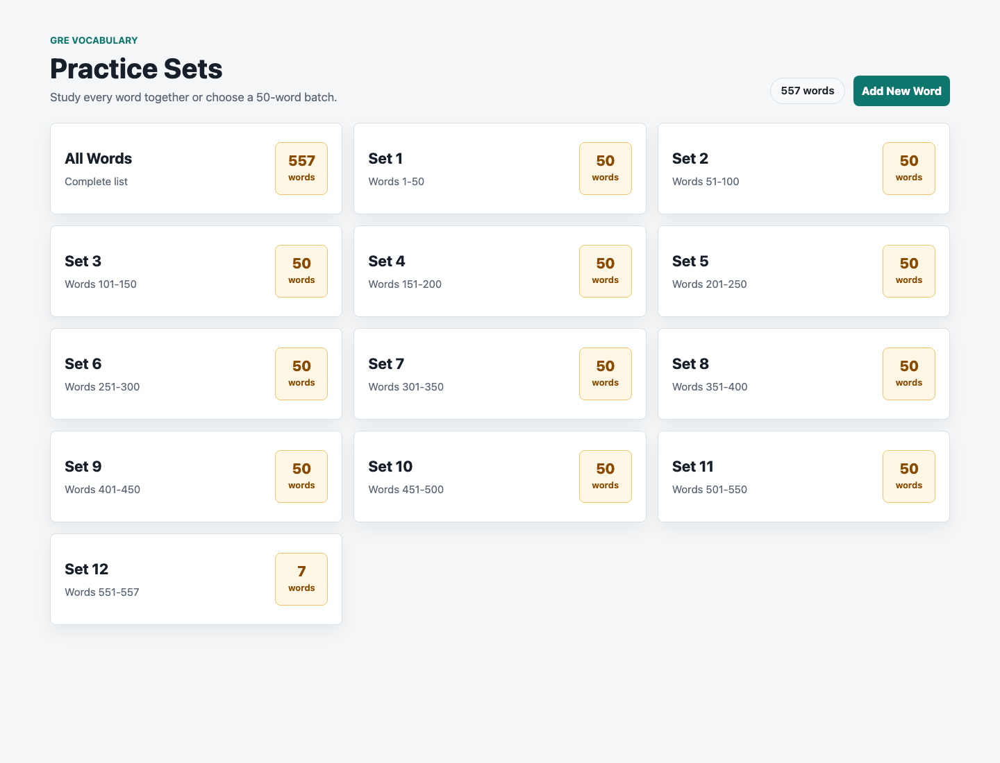
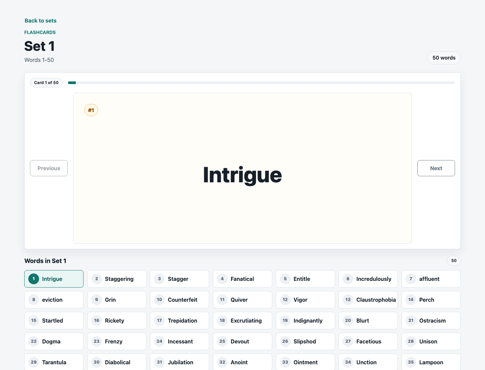

# FlashMob GRE

FlashMob GRE is a simple GRE vocabulary flashcard site. It helps users study words from an Excel word list with a clean practice-set flow and click-to-flip flashcards. The bundled word sheet currently provides GRE words with English meanings, Marathi meanings, and sample sentences.

The first screen shows practice sets:

- All Words: every word in the list.
- Set 1: words 1-50.
- Set 2: words 51-100.
- Later sets continue in 50-word batches.

Each flashcard first shows only the word. Clicking the card flips it to show the English meaning, Marathi meaning, and a sample sentence. Clicking it again flips back to the word.

Users can also add new words from the practice-sets page. The `Add New Word` button opens a modal with two modes: add one word manually, or import multiple words from an Excel/CSV file. The app normalizes submitted English words, checks the Excel sheet for existing normalized matches, skips duplicates, and appends accepted unique words to the sheet.

## Screenshots

Practice set selection:



Flashcard practice view:



## Tech Stack

- Frontend: React, TypeScript, Vite, Bootstrap, React Bootstrap
- Backend: Spring Boot, Java, Apache POI
- Data source: `Backend/flashMobGre/src/main/resources/Words.xlsx`

## Word Sheet

The active word sheet is:

```text
Backend/flashMobGre/src/main/resources/Words.xlsx
```

The backend reads this Excel file when `/getWordData` is called. The first row is treated as a header row and skipped. Each word row should use this column order:

```text
Word | Marathi Meaning | English Meaning | Sample Sentence
```

To customize the app for your own words:

1. Open or replace `Backend/flashMobGre/src/main/resources/Words.xlsx`.
2. Keep the same four-column format.
3. Add your own words, meanings, and sample sentences.
4. Restart the backend so the updated sheet is loaded.

The frontend will automatically create practice sets from however many rows are in the sheet.

You can also add words through the site UI. Submitted words are saved to the same sheet. The app requires the English word, Marathi meaning, and sample sentence; English meaning is optional. Marathi meanings must be written in Devanagari script.

For bulk imports, upload `.xlsx`, `.xls`, or `.csv` files with the same four-column format. The first row is skipped as a header. If a file contains words that already exist in the sheet, repeats the same word within the file, or has a Marathi meaning outside Devanagari script, those rows are skipped and only valid unique words are added.

## Project Structure

```text
Backend/flashMobGre/              Spring Boot API
Frontend/flashmob-gre-frontend/   React frontend
```

## Run Locally

Start the backend:

```bash
cd Backend/flashMobGre
bash ./mvnw spring-boot:run
```

The backend runs on `http://localhost:8080`.

Start the frontend:

```bash
cd Frontend/flashmob-gre-frontend
npm install
npm run dev
```

The frontend runs on `http://localhost:3000` and proxies API calls to the backend.

## Environment Configuration

The backend uses Spring profiles:

- Default/local settings: `Backend/flashMobGre/src/main/resources/application.properties`
- Local override: `Backend/flashMobGre/src/main/resources/application-local.properties`
- Production override: `Backend/flashMobGre/src/main/resources/application-prod.properties`

The default Spring profile is `local`, so this works for local development:

```bash
cd Backend/flashMobGre
bash ./mvnw spring-boot:run
```

In production, run with the `prod` profile and set the frontend origin:

```bash
SPRING_PROFILES_ACTIVE=prod
APP_CORS_ALLOWED_ORIGINS=https://your-frontend-domain.example
WORDS_EXCEL_PATH=/path/to/persistent/Words.xlsx
WORD_ADDITION_PASSWORD=choose-a-strong-password
```

`APP_CORS_ALLOWED_ORIGINS` controls which frontend domains can call the backend. Use a comma-separated list if you need more than one origin.

`WORD_ADDITION_PASSWORD` protects the word-addition and file-import endpoints. Do not put this value in frontend environment variables.

The frontend uses Vite environment variables:

- Local: `Frontend/flashmob-gre-frontend/.env.development`
- Production template: `Frontend/flashmob-gre-frontend/.env.production.example`

For a production build outside the repository Blueprint, set:

```text
VITE_API_BASE_URL=https://your-backend-domain.example
```

## Deployment

The root-level `render.yaml` is a Render Blueprint for the complete application:

- `flashmob-gre-api`: free Docker-based Spring Boot web service
- `flashmob-gre-web`: Vite-powered Render static site

In the Render Dashboard:

1. Choose **New > Blueprint** and connect this repository.
2. Keep the Blueprint path as `render.yaml`.
3. Enter a strong `WORD_ADDITION_PASSWORD` when Render prompts for it.
4. Apply the Blueprint.

The Blueprint automatically:

- activates the backend's `prod` Spring profile;
- creates a writable workbook at `/tmp/Words.xlsx`;
- wires the Render frontend URL into the backend CORS configuration;
- wires the Render API URL into the Vite production build;
- pins the static-site build to Node.js 24.14.1 and installs from `package-lock.json`;
- configures `/health` as the API health check;
- rewrites static-site routes to `index.html` for React Router.

Both services deploy for free. Render's free web services use an ephemeral filesystem, so words added through the UI are lost whenever the API spins down, restarts, or redeploys. On each fresh startup, the backend seeds `/tmp/Words.xlsx` from the bundled workbook. Commit permanent word-list changes to `Backend/flashMobGre/src/main/resources/Words.xlsx`.

If you later attach a custom domain to the static site, update the API service's `APP_CORS_ALLOWED_ORIGINS` value to that exact origin and redeploy the API.

## API

Check API health:

```http
GET /health
```

Get all words:

```http
GET /getWordData
```

Get one 50-word set:

```http
GET /getWordData?offset=50&limit=50
```

`offset` is zero-based, so `offset=0&limit=50` returns words 1-50 and `offset=50&limit=50` returns words 51-100.

Add a word:

```http
POST /addWord
Content-Type: application/json
X-Word-Addition-Password: your-password

{
  "word": "Resolute",
  "marathiMeaning": "Marathi meaning",
  "englishMeaning": "Firm or determined",
  "sampleSentence": "She remained resolute during the interview."
}
```

If the normalized word already exists in the sheet, the API returns `409 Conflict`.

Import words from Excel or CSV:

```http
POST /addWordsFile
Content-Type: multipart/form-data
X-Word-Addition-Password: your-password

file=<words.xlsx | words.xls | words.csv>
```

The response includes `addedCount`, `skippedCount`, `addedWords`, and `skippedWords`.

## Checks

Frontend:

```bash
cd Frontend/flashmob-gre-frontend
npm run build
npm test
```

Backend:

```bash
cd Backend/flashMobGre
bash ./mvnw test
```
